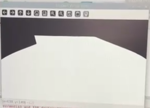
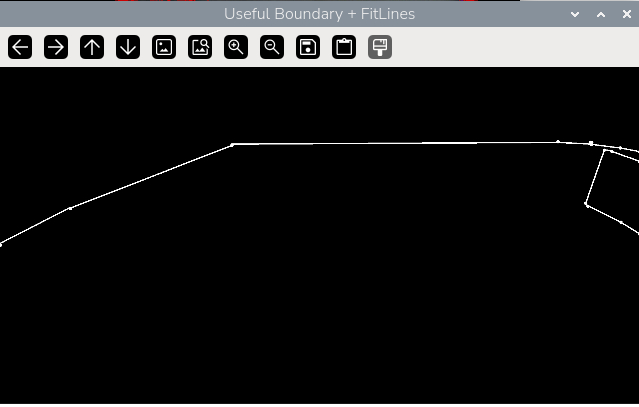
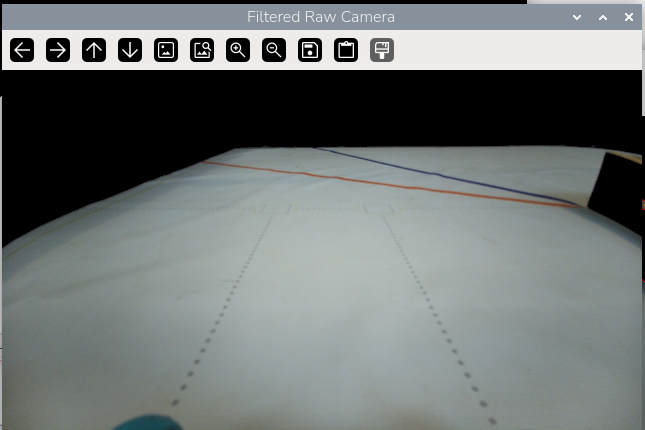
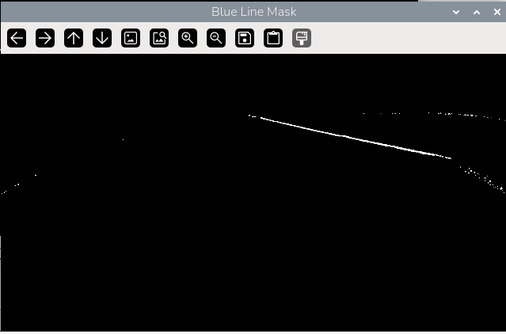
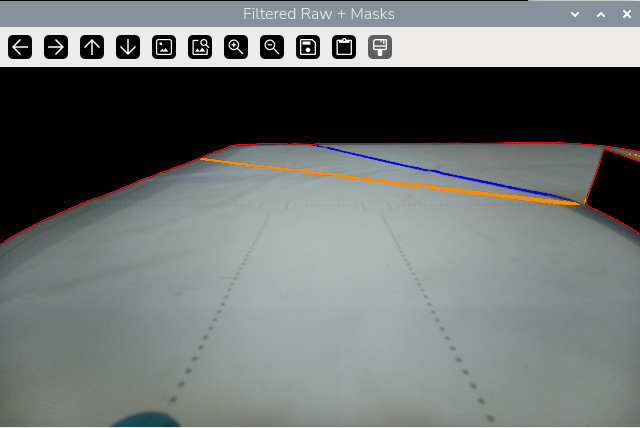

# Mat boundry and line detection coding

Our main sensor in charge of navegation of the mat is going to be our camera. This entry will explain our first attempt to detect all of the different aspects of the mat including the orange and blue lines, and the black boundries inside and outside of the mat. Having an effective way of detecting these aspects are crucial to navegate the mat accurately.

## Field Boundries

### Startup
Since we upgraded the camera from the [OV5647](../../../hardware/electrical/Raspberry_π_3B+/Camera/OV5647.md) to the [IMX708](../../../hardware/electrical/Raspberry_π_3B+/Camera/IMX708.md) because of its better resolution and Field of View, we had to capture de frames a differet way, [here's](../code/srs/imx708start.py) how we coded did it. 

You'll notice we asked for frames with the sensor on **2304 x 1296** because we need the full FOV, and then displayed it in a preview in only **640 x 360**, we did this so the Raspberry pi doesnt have to display so many pixels on the preview, thus saving on processing power.

---

### Finding and contouring white pixels from the field
Now we wanted to have an image that filtered only the things inside the rideable field. We used the OpenCV function **Greyscale**, which escencially turns every pixel to a 0-255 value of darkness, this displays a black and white image. After specifing that pixels under 40 in darkness are considered black and everything else is white we get a mask of the field that we called the white blob.

<div align= "center">


"The white blob"
</div>

To this we applied the OpenCV **Contour** function which extracts the edges of a given pixel structure.

[The code here](../../../code/srs/Whiteblobcontour.py)

---
### Find edges in the useful contour

When doing the **contour** function, it give us the edge of the whole blob, and what we need is the edge between the field and the black walls, so we ask for every pixel on the contour, if theres a black to white pixel transition, if this was true we kept them and dilated them for a thicker line, and that gives us what we called the **useful contour**, after this we used **cv2.approxPolyDP**, this detects the sudden edges in a line, the agresiveness of the function can be tweaked whith **epsilon**. After detecting the edges, we placed a circle on them, and used **cv2.fitLine** to create a clean line from corner to corner.


<div align= "center">


"Usefull contour"
</div>

[The code here](../../../code/srs/edgesofuefullcontour.py)


## Line color and shape detection

### Filter out outside the play field
Remember the **white blob** mask? well the black part of that mask is what we used for the program to only see the things inside the field by simply ading:

```
filtered_raw = cv2.bitwise_and(
    frame,
    frame,
    mask=blob_mask
)
```
<div align= "center">


"filtered RAW image"
</div>

---

### Documenting line color values

Thw WRO has the play filed colors documented, but its not necessarily what the camera sees, so in order to extract the pixels in an image we need to check the values that the camera is seeing, we used [this code](../../../code/srs/checkcolorindisplay.py) to write down the color codes given from multiple points of the line. We wanted the values in HSV because if thecolor is affected by different lighting levels its easier to adjust and interpret. 

---
### Line mask
Now using the **filtered RAW image** we searched for pixels within a certain threshhold, using the readings from the [checkcolor](../../../code/srs/checkcolorindisplay.py) code, 


<div align= "center">


"Blue line mask"
</div>

We later did the same with the orange line.

[Code](../../../code/srs/orangelinemask.py)

---
### Combining everything

Now we incorporeted the usefull boundry in red and the blue and orange lines in the filtered RAW display, to see all of the codes work!


<div align= "center">


</div>

Because of not having anything to practice traffic sign detection with we haven't  developed that part of the program.

[Code](../../../code/srs/lineandboundrydtection.py)

### Next step

Now we need to brainstorm how we will use this information to navegate through the field and avoid the obstacles.


