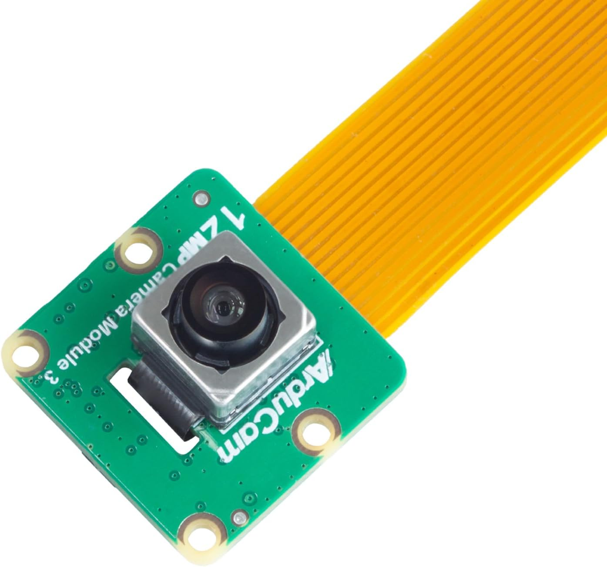

# IMX 708 Camera

The IMX708 is a camera capable of outputting frames with a 120° FOV(field of view), but in order to output the full FOV the camera is capable of you have to have the camera in **2304 x 1296** mode or higher. 
| Resolution | Frame Rate | Full FOV |
|:-----------|:----------:|:---:|
| 4608 × 2592 | 30 FPS | ✅ |
| 2304 × 1296 | 56 FPS | ✅ |
| 1536 × 864 | 120 FPS | ❌ |

