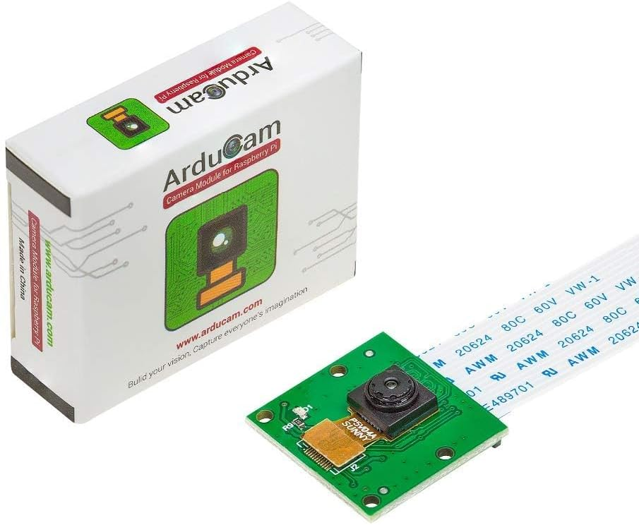

## OV5647 Camera

This is the first camera we used for AIZA. We used it until we felt it was worth it to invest in a wider FOV camera and to familiarise ourselfs with coding.

The camera had a max resolution of 1080p and had a FOV of 56°

