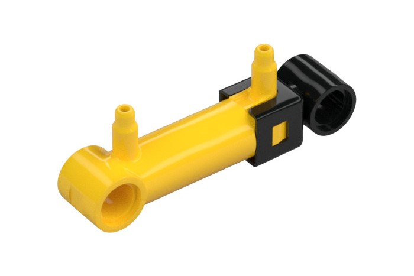
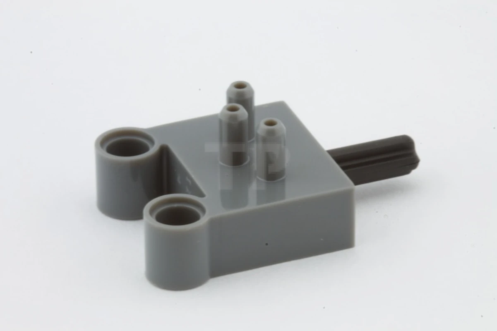

# Pneumatic Engine

The pneumatic engine is the primary mechanical power source of AIZA.
It converts the energy stored in compressed air into rotational motion,
which is then transferred to the transmission.

The engine consists of four cylinders, and 2 crankshafts, two pistons per crankshaft. Compressed air is admitted to each cylinder at a specified point in the crankshaft's rotation, producing a sequence of piston movements
that maintains continuous rotation.

### Lego pistons and valves

<table>
<tr>
<td width="50%" align="center">

**Lego Piston**
</td>
<td width="60%" valign="top">

Lego's pneumatic pistons have two inlets, depending in which inlet you apply air pressure to, the piston will contract or expand.

</td>
</tr>
</table>

<table>
<tr>
<td width="50%" align="center">

**Lego Pneumatic Valve**
</td>
<td width="60%" valign="top">

 The switches are components that control the direction of air pressure with the direction of a lever.

</td>
</tr>
</table>

Compressed air enters a cylinder and pushes the piston downward.
The connecting rod transfers this linear motion to the crankshaft,
where it is converted into rotational motion.

Once the piston reaches the appropriate position, the air supply is
stopped/exhausted and the next cylinder begins its power stroke.
By sequencing the cylinders correctly, the crankshaft can continue
rotating.