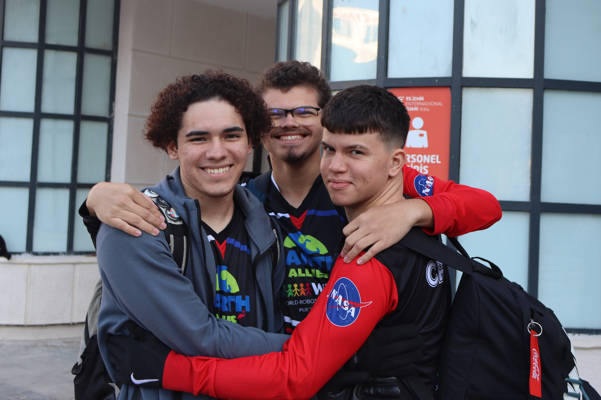
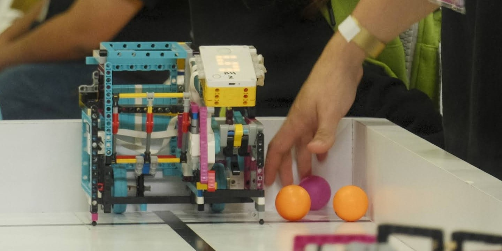

# The Primis

"Primis" is a word play of "Primus", which means "first" in latin. We picked this name because we were the first 3 in our school, Benhamin Harrison Vocational to join the puertorrican WRO delegation. 

## PRNRO 2023

In our first year of competition, we participated in the 2023 Puerto Rico National Robot Olympiad, where we aimed to qualify for the World Championship in Panama. Even though we did not win, due to the impressive design of our robot, we were considered for participation in the RoboSports category.

From left to right

* York E. Jacobs Lopez, Our Coach
* Joseph Macias Díaz
* Carlos A. Espada Rivera
* Sebastián J. Parrilla

## WRO 2023 Panama
We got an amaizing experiance and got to know a foreign country for the first time for the three of us even though we didn't win nor qualify for the play-offs of the RoboSports championship, we won amaizing experience and knowledge.

## PRNRO 2024

<table>
<tr>
<td width="50%" align="center">

</td>
<td width="60%" valign="top">

After a hard national competition at the PRNRO in May 2024, we achieved first place, this meant that we qualified to go to Turkey in the RoboSport category in the WRO 2024! Sadly, Joseph and Sebastián were unable to be present for the awards ceremony because they were attending our high school honors ceremony. 

</td>
</tr>
</table>

## WRO Open Championship For The Americas 2024

<table>
<tr>
<td width="50%" align="center">

</td>
<td width="60%" valign="top">

The  October 2024 WRO Open Championship for the Americas was held in Puerto Rico for the first time, where we achieved second place against an international field. We faced the Canadian team "Wonders" in a closely contested match, where we were dethroned in the RoboSports category.

</td>
</tr>
</table>

## WRO 2024 Turkey
In the WRO of 2024 we got a trully unforgetable experience, we were able to reach the play-off bracket and were defeated by the Saudi-Arabian team JEFF ROBOTICS, we went home with a top 32 place internationally.

</td>
</tr>
</table>

## The Last RoboSports Competition

<table>
<tr>
<td width="50%" align="center">

</td>
<td width="60%" valign="top">

Due to changes in our circumstances, as all of the original members had graduated, Carlos was the last to participate in a PRNRO in 2025, accompanied by two "rookies." This was where the cycle of learning guided by this category came to an end. With an innovative design called "El Bloque," we closed the chapter that marked our era of dominance in the category and ultimately led us to try the Future Engineers category.

</td>
</tr>
</table>

