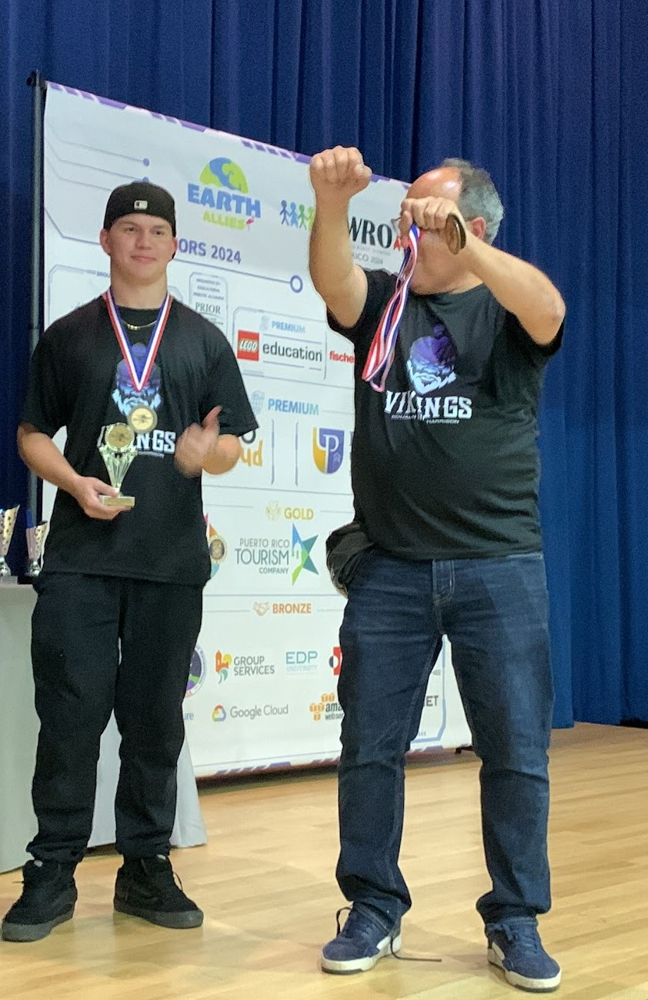
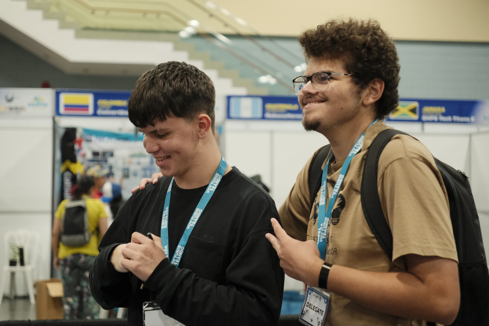
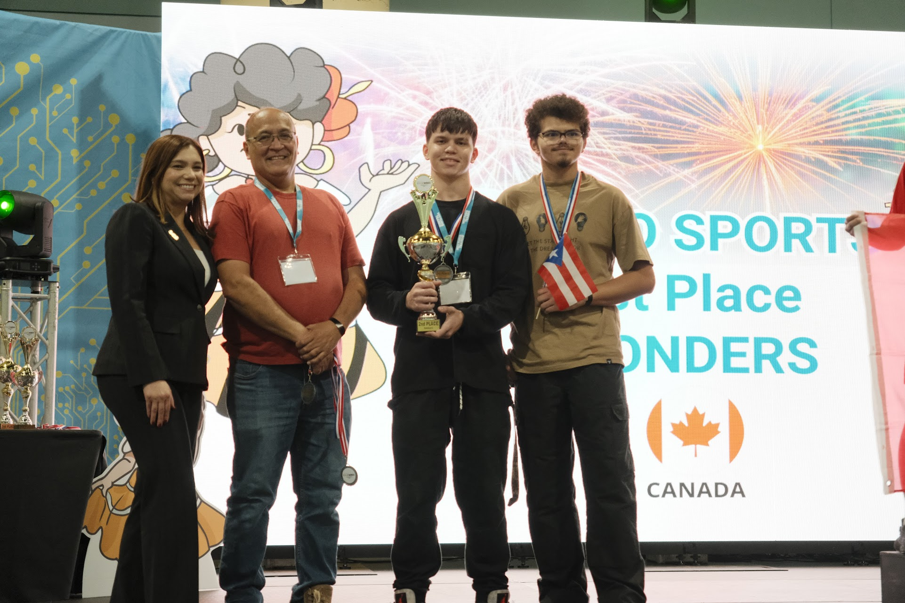
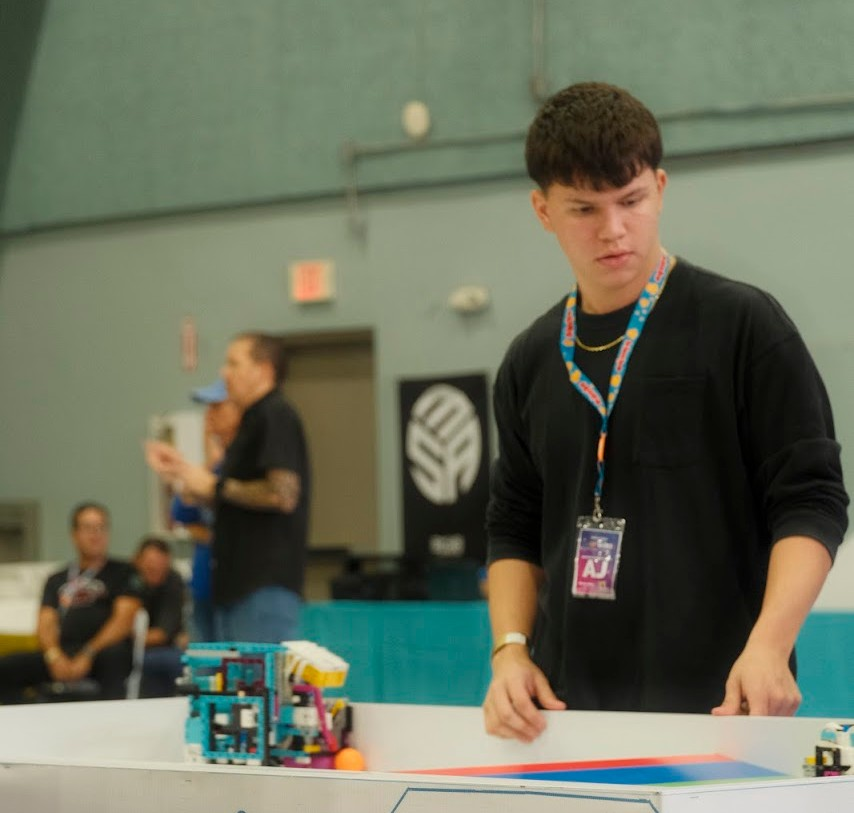
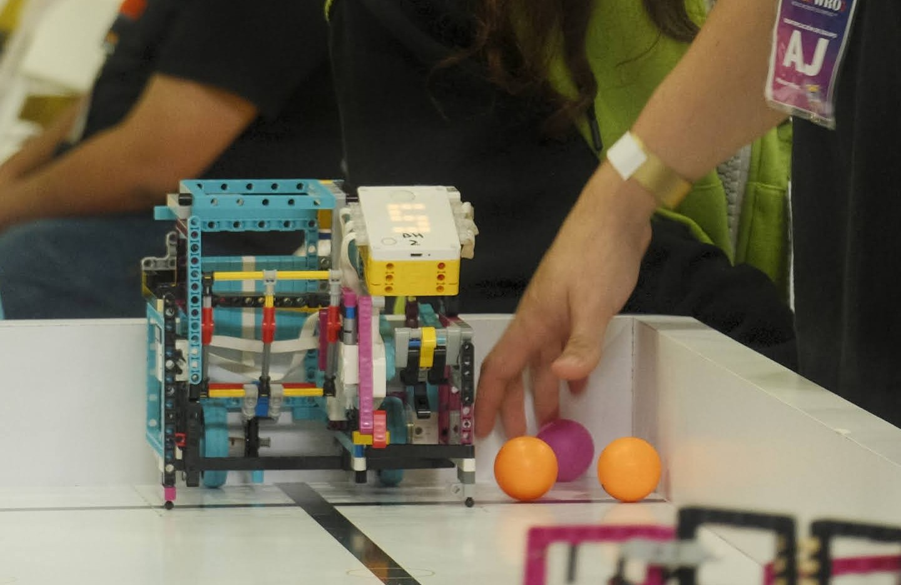

Team's photos
====

## PRNRO 2023

Nuestro primer año de competencia participamos en las Puerto Rico National Robot Olympiad donde aspirabamos a calificar para la mundial en Panamá. Aunque no ganamos, dado al diseño impresionante de nuestro robot, nos consideraron para participar en la categoría de RoboSports.

De izquierda a derehca
- York E. Jacobs Lopez, Nuestro Coach
- Joseph Macias Díaz
- Carlos A. Espada Rivera
- Sebastián J. Parrilla

## PRNRO 2024

En las nacionales, PRNRO 2024 conseguios primer lugar, tristemente Joseph y Sebastián no pudieron estar presente para la premiación dado a que estaban en nuestra graduación de escuela superior.

## WRO Open Championship For The Americas 2024

Las Open Championship de Las Americas en 2024 fueron celebradas por primera vez en Puerto Rico, donde nosotros logramos el segundo lugar ante un foro internacional. En esta nos enfrentamos en un juego reñido ante el equipo canadience "Wonders", donde fuimos destronados.

    
    
    

## La última competencia en RoboSports

Dado a cambios en la rutina ya que todos los integrantes originales se habían graduado, Carlos fue el último en participar de una PRNRO en 2025 acompañado de dos "rookies", fue aquí donde se cerró el circulo de aprendizaje guiado por esta categoría. Con un diseño innovador "El Bloque" se cerró el capítulo que marcó nuestra era de dominancia en dicha categoría y lo que nos impulsaría a participar en Futuros Ingenieros.

### El Bloque

